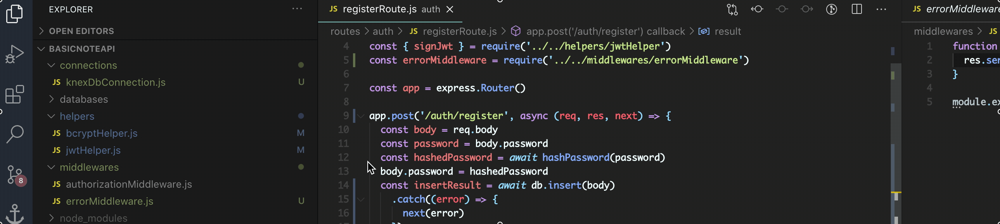
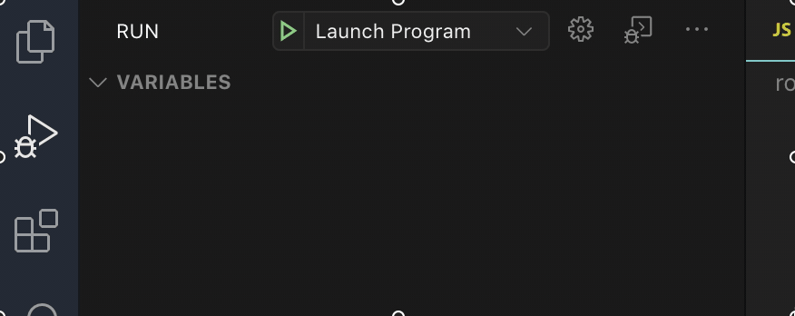
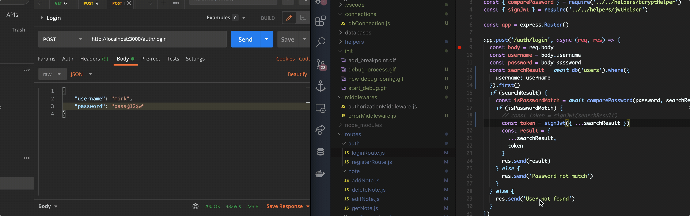
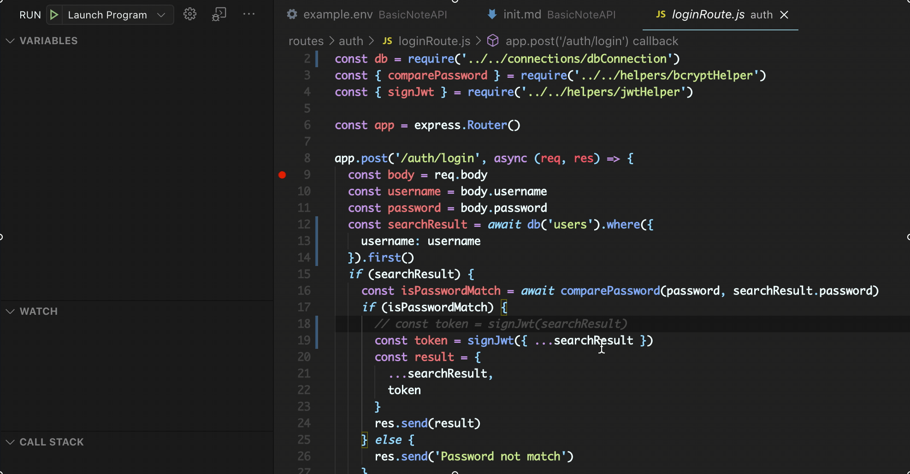
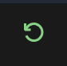

# Initialization
Things that we need to know at this branch

## New modules!
- [knex](http://knexjs.org/)
- [mysql2](https://www.npmjs.com/package/mysql2)

## New technique! 
### Debugging
Remember `console.log()`? It's a command to show what is inside a variable, by writing that
actually we already implementing what's called "debugging", means we make sure what's inside
a variable.

The scope of debugging actually is more than that, by `console.log()` (or we can call it in future
"logging") we can also make sure that our program is running as intended, for example
if we want to make sure that the variable we insert inside an if statement, is as expected.

### VSCode debugging
Than typing a lot of `console.log()` why don't we just pause the program while running and observe
variables, after we done, we can continue the program? That's where VSCode debugging comes in.

We can use VSCode debugging by creating a `launch.json`, it's a `.json` file used by VSCode as
debugging configuration in current folder

## Steps for configuring VSCode debugging
1. Create `launch.json` by
   
2. Add a breakpoint at where do we want to pause our program
   
3. Start debugger
   

----------

After that, we can debug an see variables in real time!

### Debugging controls
1. Start (`f5`)
   
2. Step over (`f10`)
   To step over to the next code
   
3. Restart debugger (`ctrl` + `shift` + `f5`)
   
   
4. Stop debugger (`shift` + `f5`)
   
   